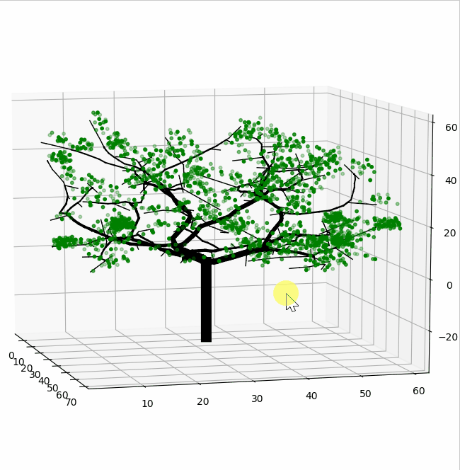
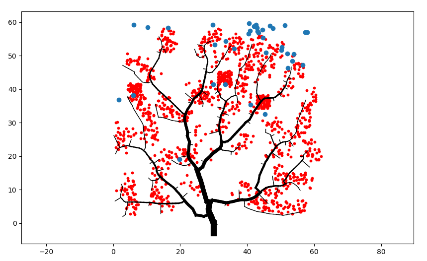
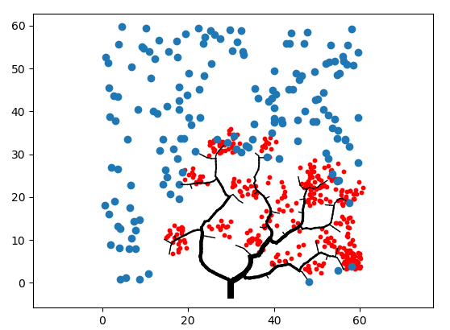

# Creating-Trees-with-space-colonization

Space Colonization is a algorithm described by Adam Runions, Brendan Lane, and Przemyslaw Prusinkiewicz.  Testing in python  
Added some nice red leaf on branches that has the minimum diameter. 
Blue points is attraction points. If an attraction point is close enough to a branch, it will attract the branch to grow towards it.

